# GBCS Test Harness Instructions

## Overview

The GBCS Test Harness is a Docker-based test environment for the GBCS (Great Britain Companion Specification) which is based on the OpenADR 3.1 standard provided by DESNZ. It provides a simulated VTN (Virtual Test Node) and a test harness to test the GBCS protocol implementation of a VEN (Virtual End Node). 

## Prerequisites

- Docker installed and running

## Optional Tooling
- Bruno for editing the test scripts and for mocking the VEN

## Installation and execution

1. Save the following to a file named `compose.yaml` on your machine
    ```yml
    name: gbcs-test-harness
    services:
      gbcs-th:
        image: stevekay72/gbcs-th:latest
        hostname: gbcs-th
        ports:
        - 8082:8080
        networks:
        - gbcs-th-network

      vtn:
        image: stevekay72/gbcs-vtn:latest
        hostname: vtn
        environment:
        - BASE_URI=http://vtn:8080/openadr3/3.1.0
        - CLEAN_START=true
        - STORAGE_IMPLEMENTATION=IN_MEMORY
        ports:
        - 8081:8080
        networks:
        - gbcs-th-network

    networks:
      gbcs-th-network:
        name: gbcs-th-network
        external: false
        driver: bridge
    ```
    
2. Start the test harness:
   ```bash
   docker compose up -d
   ```

## Usage

1. Open the GBCS Test Harness in your browser:
   ```bash
   http://localhost:8082
   ```

2. Click on the "Run Test" button to open the scenario test run page

   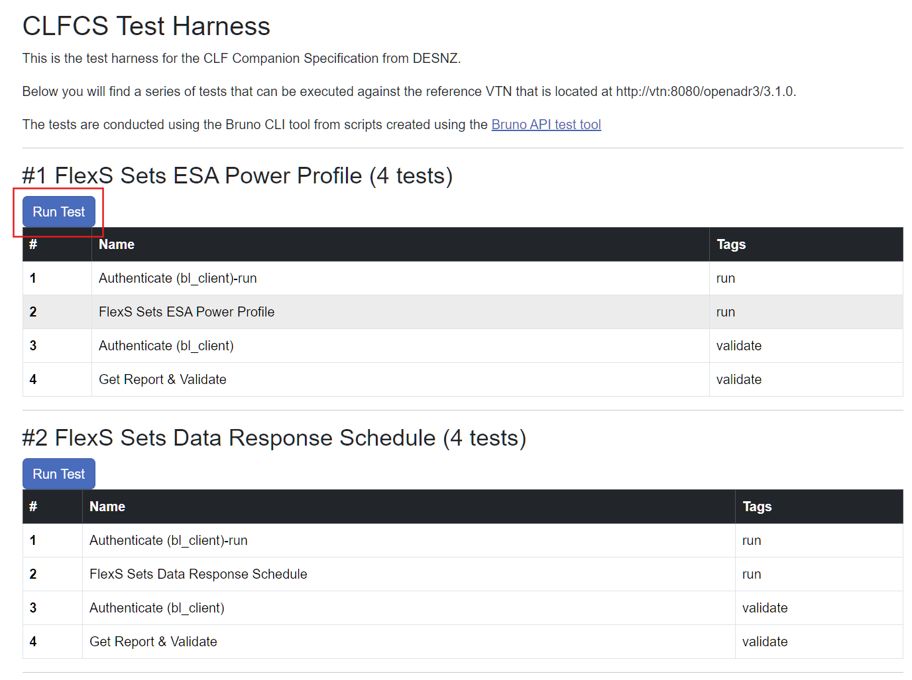

3. Click on the "Run Test" button to start the test run

    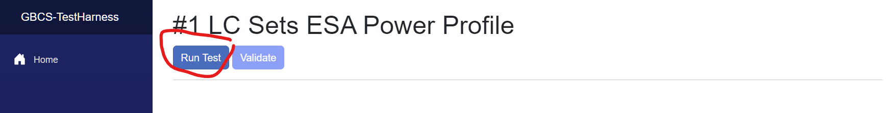

4. When the ESA has responded, click on the "Validate" button to validate the test run

    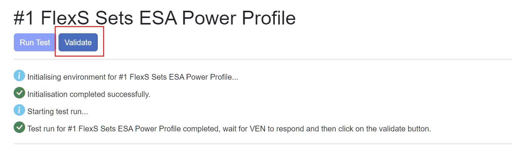

5. Test completed (PASS)

    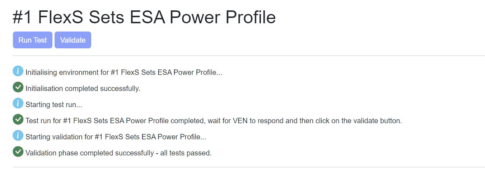

6. Test completed (FAIL)

    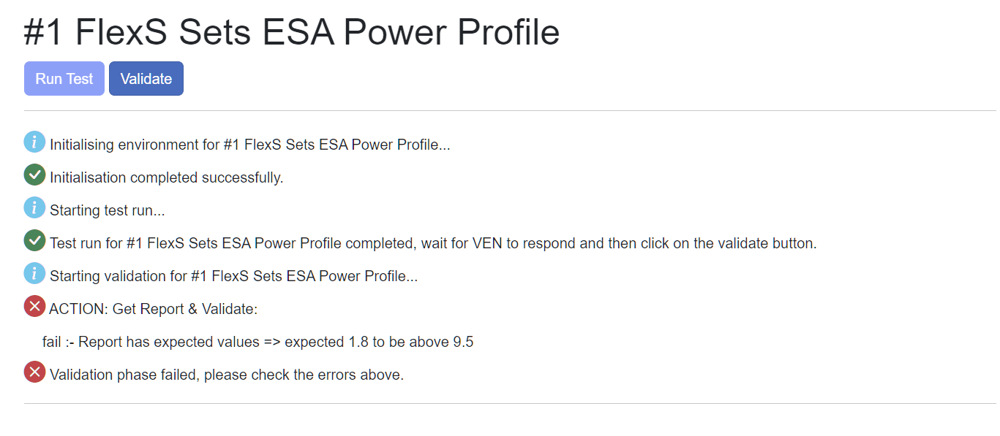

## Test Collections

The container image contains the following test collections:

- _init
- #1 LC Sets ESA Power Profile 
- #2 LC Sets Data Response Schedule

The test collections are divided into two phases:

- **run** - This phase is used to run the test scenario.
- **validate** - This phase is used to validate the test run and should be run after the run phase.

> ‼️**IMPORTANT** These phases are marked in the test scripts by a **tag** that is applied to each request within Bruno.  

### _init Collection
The _init  test collection is used to set up the test environment and should be run before any other test collections.  
It performs the following actions:

- Authenticates with the VTN using the **bl_client** credentials
- Resets the VTN to a clean state
- Creates a new **VEN** object with id **0** to represent the **ESAM**
- Creates a new **RESOURCE** object with id **0** to represent the **ESA** that is attached to the **ESAM**
- Creates a new **PROGRAM** object with id **0**

The program that is created is referenced by the event that is created in each of the test collections to perform the required actions to test the scenario and validate the response.

### #1 LC Sets ESA Power Profile Collection
This collection is used to test the scenario where the ESAM sends an event to the ESA to set the power profile of the ESA.
It performs the following actions in the **run** phase:

- Authenticates with the VTN using the **bl_client** credentials
- Creates an **EVENT** to the VTN with a body that is used to set the power profile of the ESA

Once the ESA has responded, the **validate** phase is run to validate the test run:

- Authenticates with the VTN using the **bl_client** credentials
- Validates the response from the ESA by fetching the reports and checking the values

### #2 LC Sets Data Response Schedule Collection
This collection is used to test the scenario where the ESAM sends an event to the ESA to set the data response schedule of the ESA.
It performs the following actions in the **run** phase:

- Authenticates with the VTN using the **bl_client** credentials
- Creates an **EVENT** to the VTN with a body that is used to set the data response schedule of the ESA

Once the ESA has responded, the **validate** phase is run to validate the test run:

- Authenticates with the VTN using the **bl_client** credentials
- Validates the response from the ESA by fetching the reports and checking the values

## Editing scripts
The following assumes that you have Bruno installed and available on your path and are familiar with using it.

1. Clone the repository:
   ```bash
   git clone https://github.com/MethodsBDT/gbcs-test-harness
   ```

2. Open Bruno and import the test collection:
   ```bash
   ./Bruno/OpenADR Testing
   ```
You will see the following test collections:

- _init **(DO NOT EDIT THIS COLLECTION)**
- #1 LC Sets ESA Power Profile 
- #2 LC Sets Data Response Schedule

Add, edit and remove requests from the test collections as required.  
>❌ **DO NOT EDIT THE _init COLLECTION**

### Using the amended scripts with the harness
>‼️ Be sure to include the **_init** collection in your test collections or the executiuon will fail

1. Get the full path to the parent folder of the test collections that you want to use (e.g. C:\Development\MethodsBDT\DESNZ-WP5-Docs\Bruno\OpenADR Testing)

2. Amend the `compose.yaml` file to include the path to the test collections in the `volumes` section within the `services.gbcs-th` section as follows:
    ```yaml
    services:
      gbcs-th:
        image: stevekay72/gbcs-th:latest
        hostname: gbcs-th
        ports:
          - 8082:8080
        volumes:
          - <full_path_to_test_collections>:/bruno/
        networks:
          - gbcs-th-network
    ```
3. Execute the test harness as before:
    ```bash
    docker compose up -d
    ```
4. Open the GBCS Test Harness in your browser:
    ```bash
    http://localhost:8082
    ```

You should now be able to see your test collections displayed in the test harness.

## Troubleshooting

If you encounter any issues, please refer to the [GBCS Test Harness Instructions](GBCS%20Test%20Harness%20Instructions.md) for detailed troubleshooting steps.

# Bruno - a quick intro

Bruno is a REST API client that is used to execute the test scripts that are used by the GBCS test harness. It is a free and open source tool that is available for download from the [Bruno website](https://www.usebruno.com/). It is a good alternative to Postman for testing APIs and does not depend on an internet connection to run.

Within Bruno you can edit the test scripts to change the requests that are sent by the GBCS test harness to the VTN.  You can also add new requests to the test collections.  There is also the facility to include test scripts that will interrogate the response and allow you to validate that the data returned is as expected.

## Bruno Collection Browser
Here is where you can see the test collections that are available.  You can expand each collection to see the requests that are available executed as part of the test scenario.

You can see the `_init` collection which is used to set up the test environment and should be run before any other test collections.  The order that you can see the requests in is the order that they will be executed when running the collection.

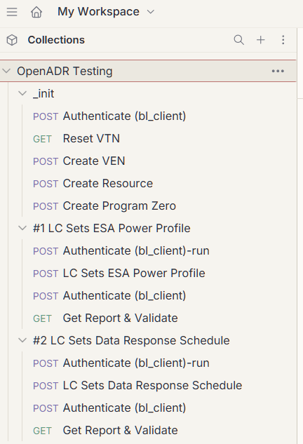

## Bruno Request Tags

Here is where you can see the tags that are applied to each request within Bruno.  These tags are used to determine which of the requests are executed as the run part of the scenario.

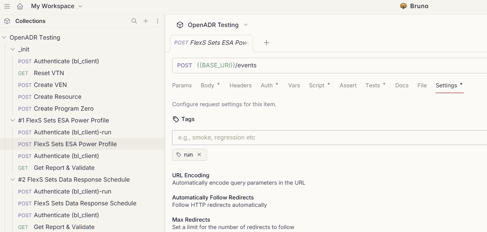

## Bruno Request Body

Here is where you can see the request body that is sent to the VTN to create the scenario from the companions specification.  Within the request you can see that there are 2 variables:
- **BASE_URI** - this is the base URI of the VTN which is passed through to the bruno command lline tool to execute the collection.
- **eventIntervalStart** - this is the start time of the event which is used to create the scenario.  It is set to the current time so that the event is picked up by the VEN immediately.  This value is generated by a script that is stored with the request and executed prior to the request being sent.

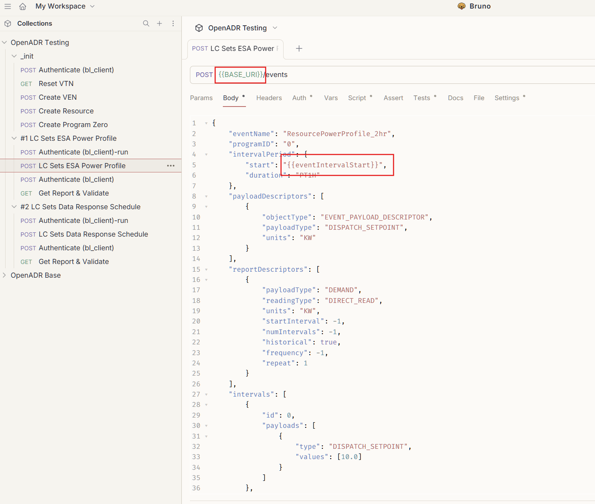

### Script
Here is the script that is executed prior to the request being sent to set the **eventIntervalStart** variable:

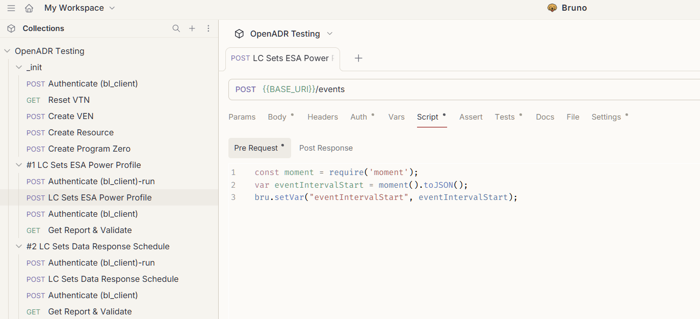

## Bruno Response Tags

Here is where you can see the tags that are stored with the request.  These tags are used to determine  which of the requests are executed as the validation of the scenario.

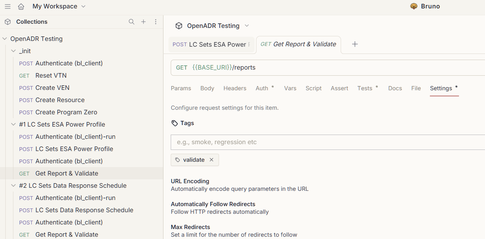

## Bruno Response Tests

Here are the tests that are executed after the request is sent to validate the response from the ESAM that has got the response from the ESA.

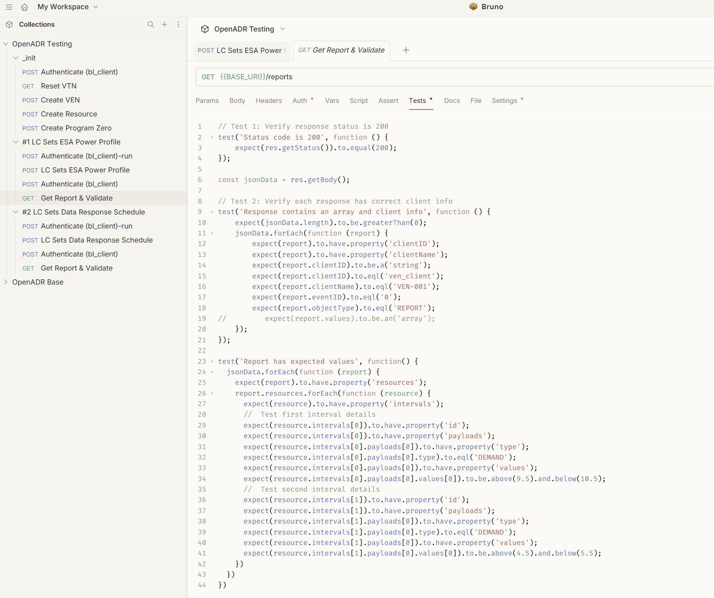
